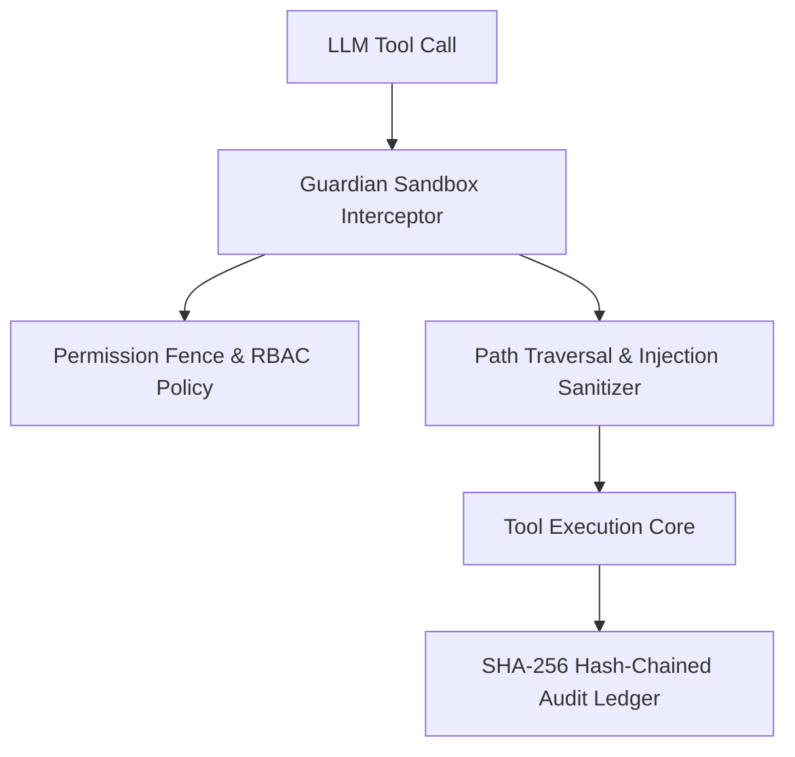

# Architecture: Ayeixa MCP Guardian

## Overview
Ayeixa MCP Guardian acts as a zero-trust security proxy between LLM agents and MCP tool execution environments.

## System Topology

```mermaid
flowchart TD
    Agent["LLM Tool Call"] --> Sandbox["Guardian Sandbox Interceptor"]
    Sandbox --> Fence["Permission Fence & RBAC Policy"]
    Sandbox --> Sanitizer["Path Traversal & Injection Sanitizer"]
    Sanitizer --> Executor["Tool Execution Core"]
    Executor --> Audit["SHA-256 Hash-Chained Audit Ledger"]
```
